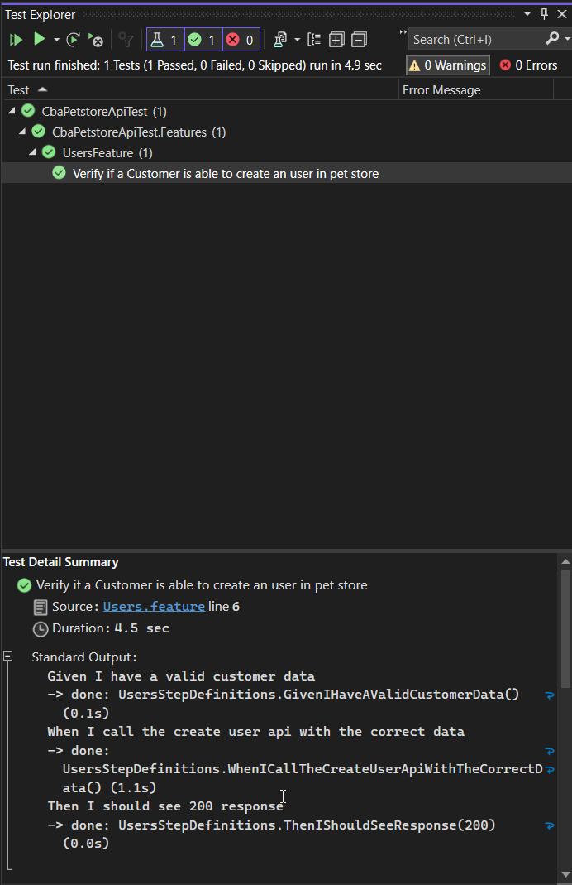
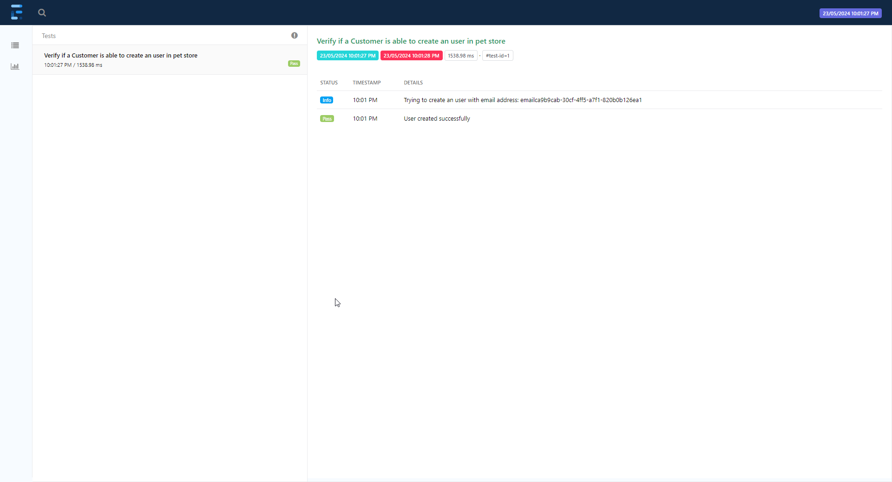
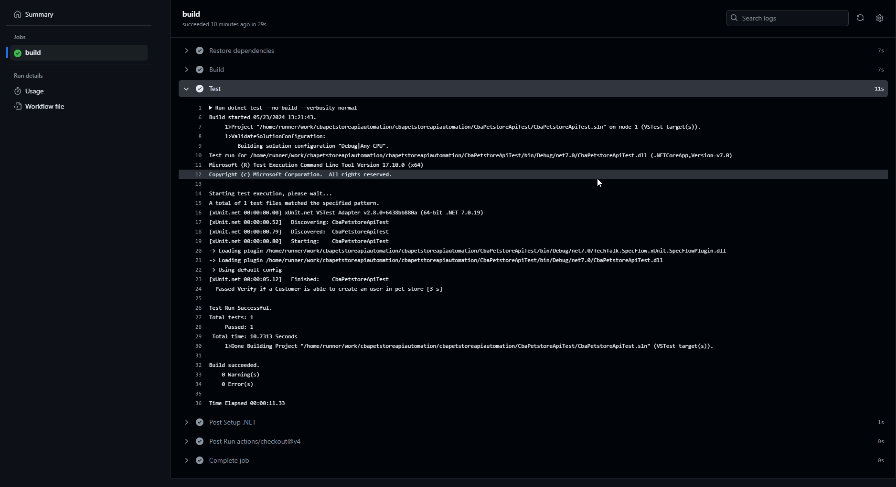

# cbapetstoreapiautomation

This project uses the below major libraries
1. Restsharp
2. XUnit
3. Specflow
4. Extent Report

BDD Style Tests:
The tests are written in the form of BDD. 

Execution in Visual Studio:
The test can be run in visual studio through Test Explorer.

Command to run it from command prompt:
dotnet test CbaPetstoreApiTest.csproj

For now, the test html report(Extent) gets generated in this location - cbapetstoreapiautomation\CbaPetstoreApiTest\bin\Debug\net7.0\extentReport.html
To do: This file will need to be hosted in a static hosting website, so that everyone can access it. 
Sample Test Report:

Github actions:
Github actions workflow to run the test has been created for this project under .github\workflows.
After every commit, the test would get executed through github actions.

